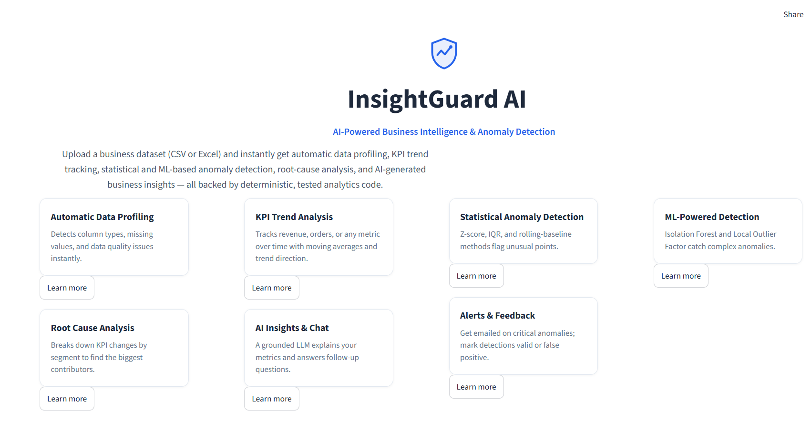
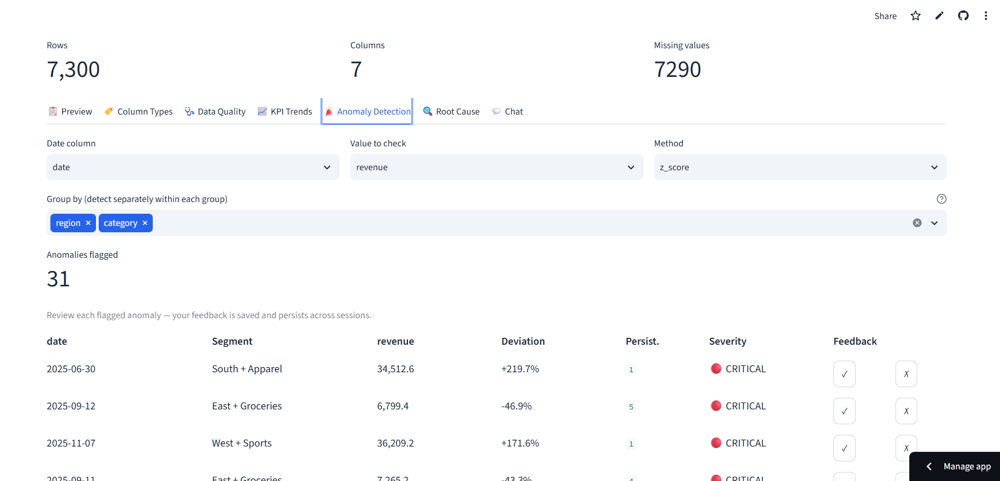

# InsightGuard AI


🔗 **[Live Demo](https://insightguard-ai.streamlit.app/)**

AI-powered business intelligence & anomaly detection platform. Upload business
data (CSV/Excel), and the app automatically profiles the dataset, tracks KPI
trends, detects statistical and ML-based anomalies, identifies likely drivers,
and generates grounded business explanations using an LLM.

> ✅ **Status: Complete and deployed.** Full pipeline — profiling, KPI
> trends, statistical + ML anomaly detection, severity scoring, root cause
> analysis, LLM-grounded insights, a tool-calling chat agent, email alerts,
> and a feedback loop — is live and working end-to-end.
>
> **Note on the live demo:** Streamlit Community Cloud's free tier uses
> ephemeral storage, so the feedback loop (SQLite) resets on redeploy.
> Locally, feedback persists indefinitely across restarts.

## Why this project

Most "AI dashboard" projects let an LLM read a spreadsheet and guess at
insights. InsightGuard AI does the opposite: **all numbers come from
deterministic Python/statistics/ML code**, and the LLM's only job is to
explain and contextualize numbers it's handed — never to invent them. This is
closer to how real analytics/BI systems that use AI are actually built.

## Current data pipeline

```text
Upload (CSV/Excel)
   ↓
Column classification (datetime / numeric / categorical / identifier)
   ↓
Data quality report (missing values, duplicates, constant columns, outlier flags)
   ↓
KPI aggregation (multi-row-per-day → clean daily/weekly/monthly time series)
   ↓
Trend metrics (% change, moving average, volatility, trend direction)
```

Each stage is implemented as a standalone, independently-tested module
(`src/profiling.py`, `src/kpi_engine.py`) rather than logic embedded directly
in the UI — this keeps the analytics layer reusable once the anomaly
detection and LLM layers are added on top.

## Planned features


- [x] Dataset upload (CSV/Excel) + preview
- [x] Automatic data profiling & data-quality report
- [x] KPI trend analysis (% change, moving average, volatility, trend classification)
- [x] Statistical anomaly detection (Z-score, IQR, rolling baseline) with labeled-data evaluation
- [x] ML anomaly detection (Isolation Forest, LOF) with precision/recall comparison
- [x] Anomaly severity scoring
- [x] Root-cause / driver analysis (segment-level contribution breakdown)
- [x] LLM-grounded business insight generation (Groq API, structured-data-only, non-causal language)
- [x] Chat-with-your-data agent (tool-calling: KPI trend, drivers, anomalies, data quality)
- [x] Anomaly history + feedback loop (SQLite, persists across sessions)
- [x] Email alerts for critical anomalies (Gmail SMTP, free)

## Tech stack

- **App**: Streamlit (Python-only, single deployable app)
- **Data**: Pandas, NumPy
- **ML**: scikit-learn (Isolation Forest, Local Outlier Factor)
- **LLM**: Groq API (`openai/gpt-oss-20b`, free tier) — receives only pre-computed structured JSON, never raw data
- **Storage**: SQLite (anomaly history/feedback)
- **Deployment**: Streamlit Community Cloud (free)

## Evaluation approach

Real business data has no ground-truth "this was an anomaly" labels. To
actually measure detection quality (not just eyeball it), this project
generates a synthetic dataset with **deliberately injected, labeled
anomalies** (`src/generate_synthetic_data.py`) covering sudden drops, sudden
spikes, and sustained multi-day dips. Each detection method is evaluated
against these ground-truth labels using precision/recall/F1 — see
`docs/evaluation.md` (added in Phase 5/6) for results.

### Statistical method results (Day 4)

### Anomaly detection method comparison (Days 4-5)


Evaluated against 10 ground-truth injected anomalies across 7,300 rows
(4 regions × 5 categories × 365 days), detecting independently per
region+category segment:

| Method | Category | Precision | Recall | F1 |
|---|---|---|---|---|
| Z-score | Statistical | 0.290 | 0.900 | **0.439** |
| IQR | Statistical | 0.122 | 0.900 | 0.214 |
| Local Outlier Factor | ML | 0.087 | 0.700 | 0.156 |
| Rolling baseline (14-day) | Statistical | 0.093 | 0.400 | 0.151 |
| Isolation Forest | ML | 0.075 | 0.600 | 0.133 |

**Key findings:**
- Z-score outperformed every other method, including both ML approaches.
  This matches known ML theory: Isolation Forest and LOF are designed for
  multivariate anomaly detection, where anomalies only emerge from
  *combinations* of features. For univariate detection (a single measure
  like revenue), simple statistical thresholds have no real disadvantage
  and are far cheaper to compute and easier to explain.
- ML method performance was highly sensitive to the `contamination`
  parameter (the assumed anomaly rate). An initial run with the common
  default of 5% produced 370 false positives against only 10 true
  anomalies (0.14% real rate) -- precision of 0.026. Calibrating
  contamination down to 1% (closer to the actual rate) improved precision
  roughly 3x, though it required knowing the true rate in advance, which
  is rarely available on real, unlabeled business data.
- Rolling-baseline's weakness on the *sustained* multi-day anomaly reveals
  a real limitation of adaptive-baseline methods: the model began treating
  the ongoing dip as "the new normal" after just one day.

**Takeaway:** simpler methods aren't automatically worse. Method choice
should be driven by the actual structure of the data (univariate vs.
multivariate, stable vs. trending) rather than assuming more sophisticated
= better.

### Chat agent (Day 8)

A single agent with four deterministic tools (`get_kpi_trend`, `get_top_drivers`,
`get_anomaly_summary`, `get_data_quality_summary`) — the LLM chooses which
tool(s) to call based on the question, executes them, and answers using
only the returned results. Tested for multi-turn context (follow-up
questions correctly resolve pronouns like "those" to prior results) and for
honest failure modes: when asked a question the available tools can't
answer (e.g. per-segment anomaly counts, which aren't currently computed),
the agent explicitly says so rather than fabricating a plausible-sounding
answer.

### Email alerts (Day 9)

CRITICAL-severity anomalies (from the Day 5 severity scoring system) can
trigger an email alert via Gmail SMTP — no paid service or third-party API
required, just a free Gmail App Password. Deliberately scoped down from a
full alert-fatigue-prevention system (deduplication, cooldowns, escalation)
since that's meaningful additional engineering with limited portfolio value
for a single-user demo app; only CRITICAL items (not LOW/MEDIUM/HIGH) send
an email, which is the core idea of not spamming on every minor blip.


### Feedback loop (Day 9)

Users can mark any flagged anomaly as ✓ Valid or ✗ False Positive directly
in the UI. Feedback is stored in a local SQLite database (`data/feedback.db`,
gitignored — it's per-user runtime data, not source code) keyed by
(date, segment, KPI) rather than dataframe row position, so it correctly
persists across app restarts and dataset re-uploads. This is the
human-in-the-loop mechanism that would feed into future threshold tuning
or model retraining, though that retraining step itself is out of scope
for this build.

## Getting started

```bash
git clone <https://github.com/ashmit257codes/InsightGuard-ai.git>
cd insightguard-ai
python -m venv venv
source venv/bin/activate  # Windows: venv\Scripts\activate
pip install -r requirements.txt

# Generate synthetic sample data
python src/generate_synthetic_data.py


# Run the app
streamlit run src/app.py

# Run the test suite
pytest tests/ -v


## Project structure

```text
insightguard-ai/
├── data/           # sample/synthetic datasets
├── src/            # application + analytics code
├── tests/          # unit tests
├── notebooks/      # exploratory analysis
├── docs/           # architecture, evaluation, design notes
└── requirements.txt
```

## License

MIT
